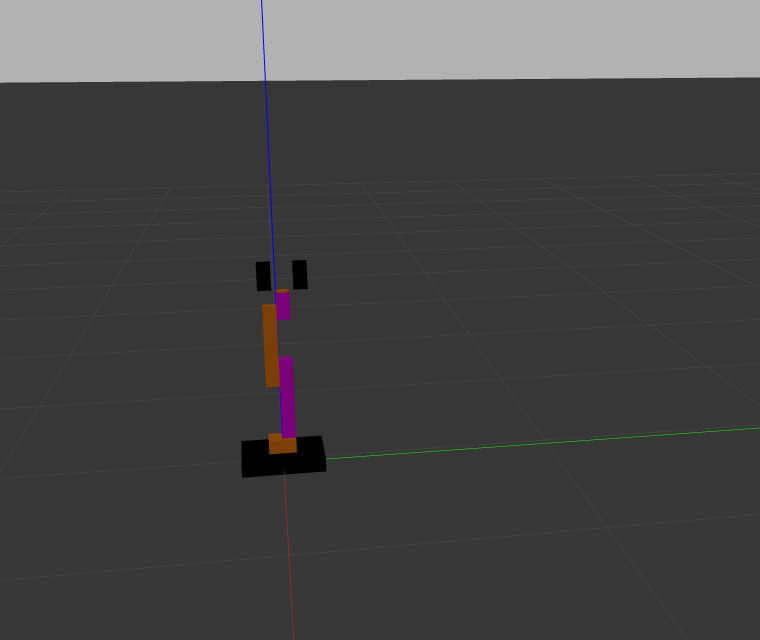

Using ROS2 Humble  
Clone the repo to get the 2 bases: Mobile base and robot arm.
Launch the desired file to get view the base in rviz or gazebo
use teleop_twist keyboard or controller to run the robot around and see the odom, baselink and wheel transforms  

Current state: -->
Mobile base can be run using teleopkeyboard
Robot arm can be controlled using joint_state_trajectory

TODO: -->  
change the rplidar scaning from a certain range  
Add kinematics to robot arm

