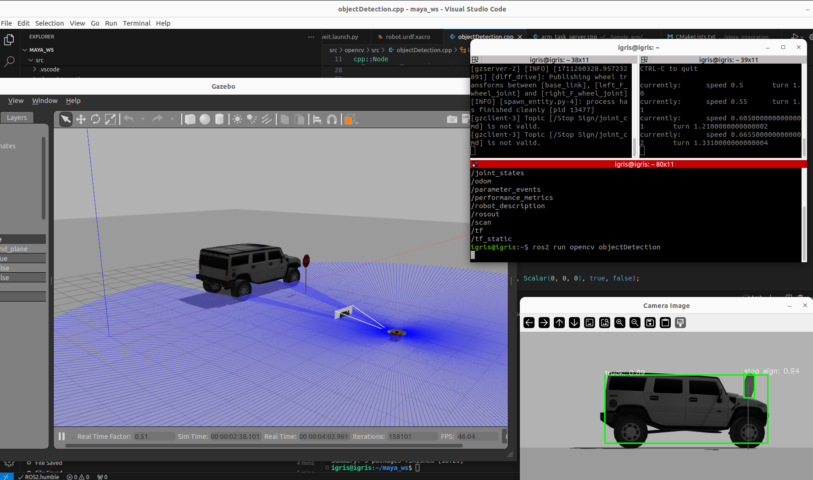

Using ROS2 Humble  
Clone the repo to get the 2 bases: Mobile base and robot arm.
Launch the desired file to get view the base in rviz or gazebo
use teleop_twist keyboard or controller to run the robot around and see the odom, baselink and wheel transforms  

Current state: -->  
Mobile base can be run using teleopkeyboard
Robot arm can be controlled using ros2 action server by providing movement position for each joint or assigning tasks (positions can be devised using the opencv util package)

TODO: -->  
Change the rplidar scaning from a certain range.
Get depth information on identified objects and get x,y,depth coordinates.
Adding effort controller instead of position controller for gripper.

